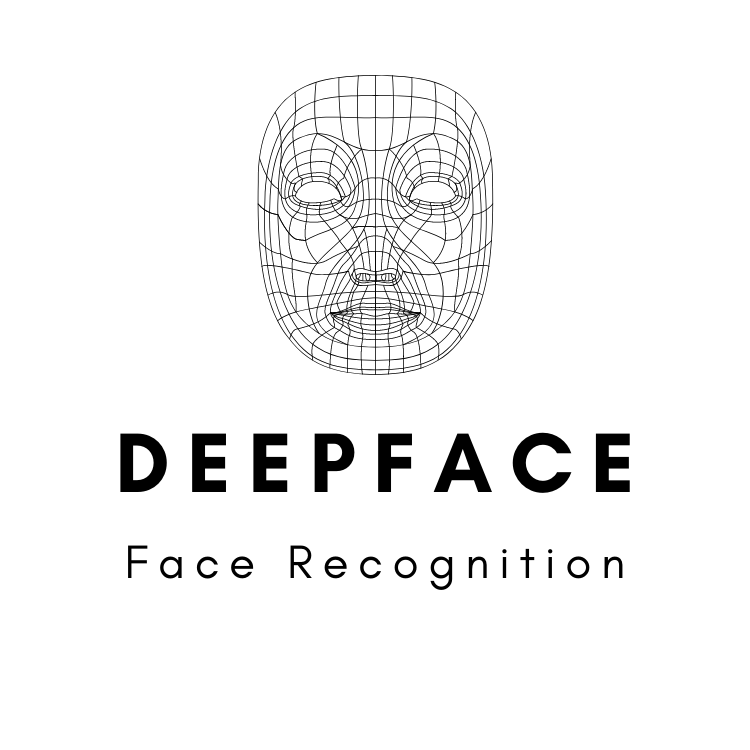

# DeepFace FaceRecognition

## Status
- Building the frontend part.
- Connecting methods to flask app.

## Signup Page

## Extract Embeddings

https://user-images.githubusercontent.com/57321948/144712802-54a19236-192a-4fb8-bce8-fc5baf54d839.mp4

## Login Page 

## Register Page

## Prediction

https://user-images.githubusercontent.com/57321948/144713007-b74a9178-e9ce-4a90-ab95-50e1e04288e0.mp4

## Face features (Emotion, Age and Gender)

https://user-images.githubusercontent.com/57321948/144713029-f8f1358e-9f13-4b58-a082-2c54648bfcbc.mp4

## Contributers:

- [@Rishav-hub](https://github.com/Rishav-hub)
- [@pradeep_psj](https://github.com/pradeepsinghjaroliya) (HTML and CSS)
