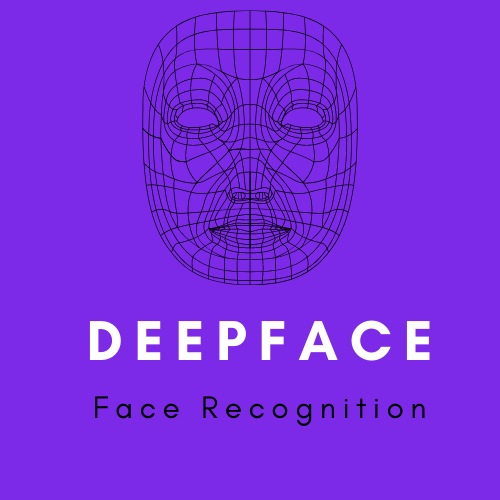
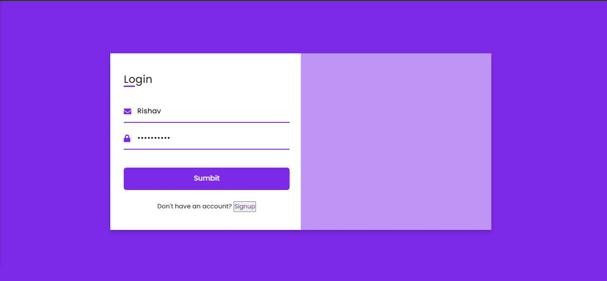

# DeepFace FaceRecognition

## Introduction -:

This is an Web Application that can be used to capture the face embeddings and stores it in a local database. You can login and use your face to predict your face. More features like Emotion recognition, Gender classification and Age prediction. This application can extended to be used in Face Unlock Application.

## Signup Page

## Extract Embeddings

https://user-images.githubusercontent.com/57321948/144712802-54a19236-192a-4fb8-bce8-fc5baf54d839.mp4

## Login Page 

## Register Page

## Prediction

https://user-images.githubusercontent.com/57321948/144713007-b74a9178-e9ce-4a90-ab95-50e1e04288e0.mp4

## Face features (Emotion, Age and Gender)

https://user-images.githubusercontent.com/57321948/144713029-f8f1358e-9f13-4b58-a082-2c54648bfcbc.mp4

## Description -:

### Multi-task Cascaded Convolutional Network (MTCNN) model for face detection

 This model has three convolutional networks (P-Net, R-Net, and O-Net) and is able to outperform many face-detection benchmarks while retaining real-time performance.
 
 

Stage 1:

- Pass in image
- Create multiple scaled copies of the image
- Feed scaled images into P-Net
-  Gather P-Net output
-  Delete bounding boxes with low confidence
-  Convert 12 x 12 kernel coordinates to “un-scaled image” coordinates
-  Non-Maximum Suppression for kernels in each scaled image
-  Non-Maximum Suppression for all kernels
-  Convert bounding box coordinates to “un-scaled image” coordinates
-  Reshape bounding boxes to square
-  
Stage 2:

- Pad out-of-bound boxes
- Feed scaled images into R-Net
- Gather R-Net output
- Delete bounding boxes with low confidence
- Non-Maximum Suppression for all boxes
- Convert bounding box coordinates to “un-scaled image” coordinates
- Reshape bounding boxes to square

Stage 3:

- Pad out-of-bound boxes
- Feed scaled images into O-Net
- Gather O-Net output
- Delete bounding boxes with low confidence
- Convert bounding box and facial landmark coordinates to “un-scaled image” coordinates
- Non-Maximum Suppression for all boxes
- 
Delivering Results:

- Package all coordinates and confidence levels into a dictionary
- Return the dictionary

### FaceNet: A Unified Embedding for Face Recognition and Clustering

FaceNet provides a unique architecture for performing tasks like face recognition, verification and clustering. It uses deep convolutional networks along with triplet loss to achieve state of the art accuracy.

Some of features of this archietecture are-:

- Triplet Loss and Selection
- Deep Learning Basics (SGD, AdaGrad and ReLU)

## Contributers:

- [@Rishav-hub](https://github.com/Rishav-hub)
- [@pradeep_psj](https://github.com/pradeepsinghjaroliya) (HTML and CSS)
